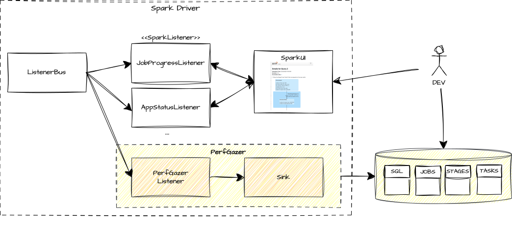

# PerfGazer

Performance Gazer for Apache Spark.

PerfGazer is a configurable Spark Listener that allows you to retrieve important stats about Spark SQL queries, jobs, and stages in a post-mortem way.

## Architecture

PerfGazer plugs into the Spark Driver as a **SparkListener**, alongside built-in listeners like `JobProgressListener` or `AppStatusListener`. The Spark **ListenerBus** dispatches execution events to all registered listeners. While the standard listeners feed the Spark UI, PerfGazer captures the same events and routes them through a configurable **Sink** to produce structured reports (SQL, Jobs, Stages, Tasks) that can be queried and analyzed programmatically — no UI navigation required.

## Why PerfGazer?

The Spark UI has limitations:

- Manual process (UI navigation)
- Often slow to load
- Limited retention (stats data is often purged)
- Not made for analytics

PerfGazer solves these problems by providing programmatic access to execution statistics.

## Features

- Post-mortem analysis of Spark SQL queries, jobs, stages, and tasks
- Measure accumulated in-executor durations
- Identify jobs with the longest cumulated execution time
- Detect Spark jobs that have spill
- Monitor SQL metrics (files read, pruned, etc.)
- Investigate predicate pushdowns and their effectiveness

## Next Steps

- [User Guide](user_guide/index.md) - Full setup and configuration
- [Contributor Guide](contributor_guide.md) - Build and development
